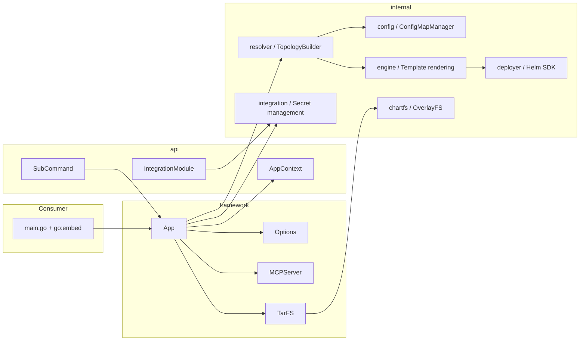
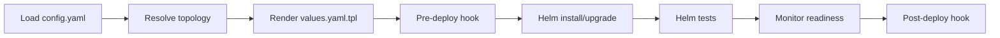

# Architecture

Helmet is a reusable Go framework for building Kubernetes installers that orchestrate Helm chart deployments with dependency resolution, configuration management, and integration handling. This document describes the framework's internal architecture, design principles, and extension points.

This page covers **framework internals and extension patterns**. For the installer packaging model, see [installer-structure.md](installer-structure.md). For dependency resolution details, see [topology.md](topology.md).

## Component Overview

Helmet separates consumer-facing APIs from internal implementation, enabling stable public contracts while allowing internal evolution. The framework follows a layered architecture where higher-level packages depend on lower-level packages, but never the reverse.



## Package Responsibilities

| Package | Scope | Consumer-Facing | Key Types |
|---------|-------|-----------------|-----------|
| `api/` | Type definitions for framework consumers | Yes | `AppContext`, `SubCommand`, `IntegrationModule`, `ContextOption` |
| `framework/` | Application bootstrap and CLI generation | Yes | `App`, `Option`, `StandardIntegrations()` |
| `framework/mcpserver/` | Model Context Protocol server | Yes | `MCPServer`, `NewMCPServer()` |
| `internal/resolver/` | Dependency topology resolution | No | `TopologyBuilder`, `Resolver`, `Topology`, `Dependency` |
| `internal/config/` | Configuration loading and persistence | No | `Config`, `ConfigMapManager`, `Product`, `Spec` |
| `internal/engine/` | Go template rendering with Sprig functions | No | `Engine`, `Variables`, `LookupFuncs` |
| `internal/deployer/` | Helm SDK wrapper for chart operations | No | `Helm` (Deploy, Verify) |
| `internal/integration/` | Integration secret management | No | `Integration`, `Interface` |
| `internal/integrations/` | Integration registry and lifecycle | No | `Manager` (11 standard integrations) |
| `internal/chartfs/` | Filesystem abstraction for charts | No | `ChartFS`, `OverlayFS`, `BufferedFiles` |
| `internal/installer/` | Orchestrates chart installation and MCP Jobs | No | `Installer`, `Job` |
| `internal/k8s/` | Kubernetes client utilities | No | `Interface`, `Kube` |
| `internal/hooks/` | Pre/post deployment hook scripts | No | `Hooks` (PreDeploy, PostDeploy) |
| `internal/flags/` | Global CLI flag definitions | No | `Flags` (Debug, DryRun, KubeConfigPath, LogLevel, Timeout) |
| `internal/subcmd/` | Standard CLI subcommand implementations | No | deploy, config, topology, integration, mcp-server, template, installer |
| `internal/mcptools/` | MCP tool definitions for AI assistants | No | `Interface`, `MCPToolsBuilder` |
| `internal/annotations/` | Helm chart annotation constants | No | `helmet.redhat-appstudio.github.com/*` |
| `internal/constants/` | Filesystem constants | No | `config.yaml`, `values.yaml.tpl`, `instructions.md` |

## Request Lifecycle

A deployment request flows through these stages. Steps 1-2 run once; steps 3-8 repeat **for each chart** in topological order:



### 1. Load Configuration

The `config.Config` type loads `config.yaml` from the installer filesystem, validates the structure, and applies defaults. Configuration includes:

- **Settings**: Global installer flags (e.g., `crc: false`, `ci.debug: false`)
- **Products**: List of products with name, enabled status, namespace, and properties

Configuration is persisted to Kubernetes ConfigMaps via `ConfigMapManager` for runtime updates. See [configuration.md](configuration.md).

### 2. Resolve Topology

The `resolver.TopologyBuilder` orchestrates dependency analysis:

1. **Collection**: Reads all Helm charts from `chartfs.ChartFS` and indexes them by name and product association
2. **Resolution**: `Resolver` builds a directed acyclic graph from chart annotations (`depends-on`, `weight`, `product-name`)
3. **Integration Validation**: Checks that required integration secrets exist using CEL expressions

The result is a `Topology` representing the sorted installation order. See [topology.md](topology.md).

### 3. Render Values Template

The `engine.Engine` processes `values.yaml.tpl` using Go's `text/template` with:

- **Sprig Functions**: Full Sprig library
- **Custom Functions**: `toYaml`, `fromYaml`, `fromYamlArray`, `toJson`, `fromJson`, `fromJsonArray`, `required`, `lookup`
- **Variables**: `.Installer.Settings`, `.Installer.Products`, `.OpenShift.Ingress.Domain`, `.OpenShift.Version`

See [templating.md](templating.md).

### 4. Pre-Deploy Hook

If the chart contains a `hooks/pre-deploy.sh` script, the framework executes it before the Helm operation. See [hooks.md](hooks.md).

### 5. Helm Install/Upgrade

The `deployer.Helm` wraps the Helm SDK (`helm.sh/helm/v3`):

1. Check if the release exists via `action.History`
2. Execute `action.Install` or `action.Upgrade` with rendered values
3. Print release metadata and notes

Each chart deployment runs in its configured namespace.

### 6. Helm Tests

The `Installer` calls `Helm.VerifyWithRetry()`, which runs `action.ReleaseTesting` (equivalent to `helm test`) with up to 3 attempts and 1-minute delays between retries.

### 7. Monitor Readiness

The `monitor.Monitor` collects released resources via `Helm.VisitReleaseResources()` and queues monitoring functions for recognized resource types (currently `Namespace` and `ProjectRequest`). `Monitor.Watch()` polls the queue at 2-second intervals until all functions succeed or the `--timeout` deadline is reached.

### 8. Post-Deploy Hook

If the chart contains a `hooks/post-deploy.sh` script, the framework executes it after Helm tests and readiness monitoring complete. See [hooks.md](hooks.md).

**Dry-run behavior**: When `--dry-run` is set, hooks (steps 4 and 8), Helm tests (step 6), and monitoring (step 7) are all skipped. Only the Helm install/upgrade (step 5) runs in server-side dry-run mode.

## Design Principles

### Convention over Configuration

Helm charts follow a predictable structure to be recognized by the framework. Annotations in `Chart.yaml` drive dependency resolution without requiring external configuration:

```yaml
annotations:
  helmet.redhat-appstudio.github.com/product-name: "api"
  helmet.redhat-appstudio.github.com/depends-on: "database"
  helmet.redhat-appstudio.github.com/weight: "100"
```

### Interface-Driven Extensibility

Major framework components are defined by interfaces:

- **`api.SubCommand`**: Custom CLI commands follow the Complete → Validate → Run lifecycle
- **`integration.Interface`**: Custom integrations implement `PersistentFlags()`, `Validate()`, `Type()`, `Data()`
- **`k8s.Interface`**: Kubernetes client operations abstracted for testability

### API Stability via Functional Options

Consumer-facing APIs use the functional options pattern:

**AppContext Options** (metadata) — from [`helmet-ex/main.go`](../example/helmet-ex/main.go):

```go
appCtx := api.NewAppContext("helmet-ex",
    api.WithVersion(version),
    api.WithCommitID(commitID),
    api.WithNamespace("helmet-ex-system"),
    api.WithShortDescription("Helmet Framework Example Application"),
)
```

**Framework Options** (runtime):

```go
app, _ := framework.NewAppFromTarball(appCtx, installer.InstallerTarball, cwd,
    framework.WithIntegrations(appIntegrations...),
    framework.WithMCPImage(mcpImage),
)
```

### Kubernetes-Native

The framework leverages Kubernetes primitives:

- **Namespaces**: Products are isolated by namespace
- **ConfigMaps**: Configuration persists in-cluster (label: `helmet.redhat-appstudio.github.com/config=true`)
- **Secrets**: Integrations store credentials as Kubernetes Secrets
- **Cluster Introspection**: Templates use `lookup` to query live cluster resources
- **OpenShift Detection**: Automatically detects OpenShift and exposes ingress domain, router CA, and version

### Helm-Centric

Helmet enhances Helm rather than replacing it:

- Uses `helm.sh/helm/v3` for all chart operations
- Any valid Helm chart works with Helmet (annotations are additive)
- Release history and rollback are preserved
- Chart tests (`helm test`) run as part of the deployment pipeline

## Extension Points

### SubCommand Interface

Custom CLI commands implement the `api.SubCommand` interface:

```go
type SubCommand interface {
    Cmd() *cobra.Command
    Complete([]string) error  // Load external dependencies
    Validate() error          // Validate configuration
    Run() error               // Execute business logic
}
```

The `api.Runner` wires this lifecycle to Cobra's `PreRunE` and `RunE`:

```go
runner := api.NewRunner(mySubCommand)
app.Command().AddCommand(runner.Cmd())
```

**Lifecycle phases**:

1. **Complete**: Load configuration, establish Kubernetes connections. Errors = infrastructure problems.
2. **Validate**: Assert required fields, check preconditions. Errors = user input problems.
3. **Run**: Execute the command's primary action. Errors = runtime problems.

### `IntegrationModule`

Custom integrations extend the framework with new credential types:

```go
type IntegrationModule struct {
    Name    string
    Init    func(*slog.Logger, k8s.Interface) integration.Interface
    Command func(*api.AppContext, *runcontext.RunContext, *integration.Integration) SubCommand
}
```

Register with:

```go
app, _ := framework.NewAppFromTarball(appCtx, tarball, cwd,
    framework.WithIntegrations(
        append(framework.StandardIntegrations(), myModule)...,
    ),
)
```

The integration's CLI command is automatically registered under `helmet-ex integration <name>`. See [integrations.md](integrations.md).

### `MCPToolsBuilder`

Custom MCP tools extend the AI assistant interface:

```go
func customTools(ctx mcptools.MCPToolsContext) ([]mcptools.Interface, error) {
    // Return custom tools
}

app, _ := framework.NewAppFromTarball(appCtx, tarball, cwd,
    framework.WithMCPToolsBuilder(customTools),
)
```

See [mcp.md](mcp.md).

## Cross-References

- [Topology](topology.md) — dependency resolution algorithm, weight-based ordering, CEL expressions
- [Integrations](integrations.md) — integration system, product coupling, custom integrations
- [MCP Server](mcp.md) — Model Context Protocol, AI assistant tools, Job-based deployment
- [Installer Structure](installer-structure.md) — tarball packaging, overlay filesystem
- [Configuration](configuration.md) — config.yaml schema, ConfigMap persistence
- [CLI Reference](cli-reference.md) — generated commands, flags, SubCommand lifecycle
