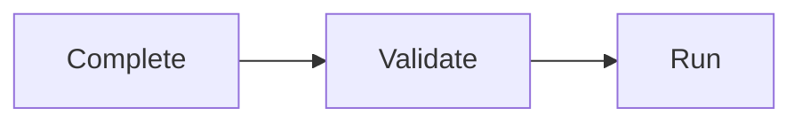

# CLI Reference

Helmet generates a complete command-line interface for every installer built with the framework. The generated CLI provides configuration management, deployment orchestration, topology visualization, integration setup, and debugging tools. This page documents the command tree, flags, lifecycle, and extension points.

For architectural context and the SubCommand interface, see [architecture.md](architecture.md). For MCP server usage, see [mcp.md](mcp.md).

## Command Tree

Every installer built with Helmet exposes the following auto-generated commands:

| Command | Purpose | Key Flags |
|---------|---------|-----------|
| `config` | Create, view, update, or delete cluster configuration | `--create`, `--get`, `--delete`, `--force`, `--namespace` |
| `deploy` | Deploy all dependencies or a single chart | `--values-template`, `--dry-run` |
| `topology` | Display dependency graph with product and integration info | None (reads from cluster config) |
| `integration <type>` | Configure integration secrets for external services | Type-specific (e.g., `--create`, `--update`, `--token`) |
| `mcp-server` | Start Model Context Protocol server for AI assistants | `--image` |
| `template <chart>` | Render values template and/or Helm chart manifests (debug) | `--show-values`, `--show-manifests`, `--namespace`, `--values-template` |
| `installer` | List or extract embedded installer resources | `--list`, `--extract` |

Global flags apply to all commands and are defined in `internal/flags/flags.go`.

## Global Flags

These flags are available for every command:

| Flag | Type | Default | Description |
|------|------|---------|-------------|
| `--debug` | bool | `false` | Enable debug mode (verbose logging) |
| `--dry-run` | bool | `false` | Enable dry-run mode (no cluster mutations) |
| `--kube-config` | string | `$KUBECONFIG` or `~/.kube/config` | Path to kubeconfig file |
| `--log-level` | string | `warn` | Log verbosity level (`debug`, `info`, `warn`, `error`) |
| `--timeout` | duration | `15m` | Helm client timeout duration |
| `--version` | bool | `false` | Show application version and commit ID |

Flags use Cobra's persistent flag mechanism, inheriting from the root command to all subcommands.

## Command Details

### `config`

Manages the installer's cluster configuration stored as a ConfigMap. Configuration defines which products are enabled, their namespaces, and global settings.

**Usage:**
```bash
helmet-ex config [flags] [path/to/config.yaml]
```

**Flags:**

| Flag | Short | Description |
|------|-------|-------------|
| `--create` | `-c` | Create new cluster configuration from file (or embedded default) |
| `--force` | `-f` | Update existing cluster configuration (requires `--create`) |
| `--get` | `-g` | Display current cluster configuration |
| `--delete` | `-d` | Delete current cluster configuration |
| `--namespace` | `-n` | Target namespace for installer (only with `--create`) |

**Behavior:**
- **No file argument**: Uses embedded `config.yaml` from installer tarball
- **With file argument**: Uses specified local configuration file
- **Dry-run mode**: Shows configuration payload without cluster mutations
- **Label selector**: Identifies configuration via `helmet.config=<app-name>` label

**Examples:**
```bash
# Create configuration from embedded defaults
helmet-ex config --create

# Create from custom file with namespace override
helmet-ex config --create --namespace prod /path/to/config.yaml

# Update existing configuration
helmet-ex config --create --force config.yaml

# View current configuration
helmet-ex config --get

# Delete configuration
helmet-ex config --delete
```

### `deploy`

Deploys Helm charts in topologically sorted order. Reads cluster configuration, resolves dependencies, validates integrations, and orchestrates Helm installations.

**Usage:**
```bash
helmet-ex deploy [chart]
```

**Flags:**

| Flag | Default | Description |
|------|---------|-------------|
| `--values-template` | `values.yaml.tpl` | Path to values template file |

**Behavior:**
- **No chart argument**: Deploys all enabled products from configuration
- **With chart path**: Deploys single chart (e.g., `charts/helmet-product-a`)
- **Dry-run mode**: Renders templates without installing to cluster
- **Validation**: Checks required integration secrets exist before deployment
- **Cleanup**: Automatically removes temporary Kubernetes resources post-install

**Examples:**
```bash
# Deploy all enabled products
helmet-ex deploy

# Deploy single chart
helmet-ex deploy charts/helmet-product-a

# Dry-run with debug output
helmet-ex deploy --dry-run --debug

# Use custom values template
helmet-ex deploy --values-template /path/to/values.yaml.tpl
```

### `topology`

Displays the resolved dependency graph with product associations, integration requirements, and installation order.

**Usage:**
```bash
helmet-ex topology
```

**Output columns:**
- **Index**: Installation order (0-indexed)
- **Dependency**: Helm chart name
- **Namespace**: Target Kubernetes namespace
- **Product**: Associated product name from annotations
- **Depends-On**: Comma-separated list of chart dependencies
- **Provided-Integrations**: Integrations this chart provides
- **Required-Integrations**: CEL expression for required integration secrets

**Behavior:**
- Reads cluster configuration via ConfigMapManager
- Parses all charts from embedded/local filesystem
- Resolves dependencies using annotations (`depends-on`, `weight`, `integrations-required`)

### `integration <type>`

Configures integration credentials for external services. Each integration type has its own subcommand with type-specific flags.

**Usage:**
```bash
helmet-ex integration <type> [flags] [args]
```

**Standard integration types:** See [integrations.md](integrations.md#standard-integrations) for the complete list of 11 standard integrations (GitHub, GitLab, Quay, ACS, and more).

**Common flags** (vary by integration):

| Flag | Description |
|------|-------------|
| `--create` | Create new integration secret |
| `--update` | Update existing integration secret |
| `--token` | Personal access token or API key |

**Behavior:**
- Stores secrets in the namespace defined by cluster configuration
- Validates secret structure before creation
- **Post-run hook**: Disables product providing the integration if secret already exists (prevents conflicts)

**Examples:**
```bash
# Configure GitHub App integration
helmet-ex integration github helmet-ex-github-app --create --token ghp_...

# Configure Quay container registry
helmet-ex integration quay --create

# Get help for specific integration
helmet-ex integration gitlab --help
```

### `mcp-server`

Starts a Model Context Protocol server that exposes installer operations as tools for AI assistants. Uses STDIO communication for integration with Claude Desktop, Continue, or other MCP clients.

**Usage:**
```bash
helmet-ex mcp-server [flags]
```

**Flags:**

| Flag | Description |
|------|-------------|
| `--image` | Container image for installer (overrides default from `WithMCPImage()`) |

**Behavior:**
- Reads `instructions.md` from installer filesystem as server instructions
- Registers tools via `MCPToolsBuilder`
- Communicates via JSON-RPC 2.0 over STDIN/STDOUT
- Runs indefinitely until client disconnects or SIGTERM

For client configuration and tool definitions, see [mcp.md](mcp.md).

### `template`

Renders the values template and/or Helm chart manifests for debugging. Useful for inspecting rendered configuration and verifying template logic.

**Usage:**
```bash
helmet-ex template <chart>
```

**Flags:**

| Flag | Default | Description |
|------|---------|-------------|
| `--show-values` | `true` | Show rendered values template as YAML |
| `--show-manifests` | `true` | Show Helm chart rendered manifests |
| `--namespace` | `default` | Namespace for template rendering |
| `--values-template` | `values.yaml.tpl` | Path to values template file |

**Behavior:**
- Requires a chart path argument
- Forces dry-run mode (cannot be disabled)
- Renders global values template using `internal/engine`
- Executes `helm template` to render chart manifests
- Combines global values with chart-specific defaults

**Examples:**
```bash
# Show only rendered global values (without chart manifests)
helmet-ex template --show-manifests=false charts/helmet-product-a

# Show only chart manifests
helmet-ex template --show-values=false charts/helmet-product-a

# Show both values and manifests
helmet-ex template charts/helmet-product-a

# Debug mode shows raw values before template rendering
helmet-ex template --debug charts/helmet-product-a
```

### `installer`

Lists or extracts the embedded installer resources (charts, config, values template) to a local directory for inspection and customization.

**Usage:**
```bash
helmet-ex installer [flags]
```

**Flags:**

| Flag | Description |
|------|-------------|
| `--list` | List embedded installer resources with sizes |
| `--extract` | Extract embedded resources to specified directory |

**Behavior:**
- Reads installer tarball embedded via `go:embed`
- Validates tar paths to prevent directory traversal attacks
- Preserves file permissions and symlinks during extraction
- Mutually exclusive flags: cannot list and extract simultaneously

**Examples:**
```bash
# List embedded resources
helmet-ex installer --list

# Extract to directory
helmet-ex installer --extract /tmp/helmet-ex-installer
```

## SubCommand Lifecycle

Every command follows a three-phase lifecycle enforced by the `api.SubCommand` interface and `api.Runner` orchestrator:



### 1. Complete

Loads external dependencies and parses arguments. Executed in `PreRunE` hook.

**Responsibilities:**
- Parse command-line arguments
- Load configuration from cluster or filesystem
- Initialize Kubernetes client connection
- Populate command-specific fields

**Error handling:** Returns error to abort before validation.

### 2. Validate

Checks that required fields are set and preconditions are met. Executed in `PreRunE` hook after Complete.

**Responsibilities:**
- Validate required fields are non-empty
- Check flag combinations are valid
- Verify file paths exist
- Assert business logic preconditions

**Error handling:** Returns error to abort before Run.

### 3. Run

Executes the command's business logic. Executed in `RunE` hook.

**Responsibilities:**
- Perform primary action (deploy, create config, etc.)
- Interact with Kubernetes API
- Render templates
- Print output

**Error handling:** Returns error to signal failure (exit code 1).

## Adding Custom Commands

Consumers can extend the generated CLI by adding custom commands to the root command or implementing the `api.SubCommand` interface.

### Method 1: Direct Cobra Commands

Add commands directly to the root command after instantiating the App:

```go
package main

import (
    "fmt"
    "os"

    "github.com/spf13/cobra"
    "github.com/redhat-appstudio/helmet/framework"
)

func main() {
    app, err := framework.NewAppFromTarball(
        appCtx, installerTarball, cwd, opts...)
    if err != nil {
        fmt.Fprintf(os.Stderr, "Error: %v\n", err)
        os.Exit(1)
    }

    // Add custom command
    customCmd := &cobra.Command{
        Use:   "custom",
        Short: "Custom operation",
        RunE: func(cmd *cobra.Command, args []string) error {
            // Custom logic
            return nil
        },
    }
    app.Command().AddCommand(customCmd)

    if err := app.Run(); err != nil {
        fmt.Fprintf(os.Stderr, "Error: %v\n", err)
        os.Exit(1)
    }
}
```

### Method 2: SubCommand Interface

Implement the `api.SubCommand` interface for lifecycle-aware commands:

```go
package custom

import (
    "github.com/redhat-appstudio/helmet/api"
    "github.com/spf13/cobra"
)

type CustomCmd struct {
    cmd *cobra.Command
    // fields
}

func (c *CustomCmd) Cmd() *cobra.Command {
    return c.cmd
}

func (c *CustomCmd) Complete(args []string) error {
    // Load dependencies
    return nil
}

func (c *CustomCmd) Validate() error {
    // Validate preconditions
    return nil
}

func (c *CustomCmd) Run() error {
    // Execute business logic
    return nil
}

func NewCustomCmd() api.SubCommand {
    return &CustomCmd{
        cmd: &cobra.Command{
            Use:   "custom",
            Short: "Custom operation",
        },
    }
}
```

Register via `api.Runner`:

```go
app.Command().AddCommand(api.NewRunner(NewCustomCmd()).Cmd())
```

## Extension Points

The CLI framework provides several extension mechanisms:

| Extension | Mechanism | Use Case |
|-----------|-----------|----------|
| Custom commands | `app.Command().AddCommand()` | Add installer-specific operations |
| Integration modules | `WithIntegrations()` option | Add support for new external services |
| MCP tools | `WithMCPToolsBuilder()` option | Customize AI assistant capabilities |

For integration module creation, see [integrations.md](integrations.md). For MCP tool development, see [mcp.md](mcp.md).

## Scope Boundaries

This page documents the **generated CLI** for installers built with Helmet. Related documentation:

- **Architecture**: [architecture.md](architecture.md) -- Component relationships, package responsibilities, request lifecycle
- **MCP Server**: [mcp.md](mcp.md) -- Model Context Protocol tools, server configuration, container image requirements
- **Topology**: [topology.md](topology.md) -- Dependency resolution algorithm, annotations, integration validation
- **Integrations**: [integrations.md](integrations.md) -- Integration module creation, secret management, CEL expressions
- **Configuration**: [configuration.md](configuration.md) -- Config schema, product properties, persistence
