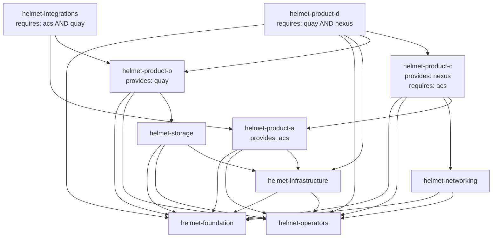

# Example Charts

The Helmet framework includes 10 example Helm charts under `test/charts/` that serve as both reference implementations and E2E test fixtures. These charts demonstrate the full range of framework features: multi-layer dependency architecture, integration provisioning and consumption, weight-based ordering, conditional deployment via CEL expressions, and namespace assignment patterns.

This page documents the chart inventory, dependency graph, key architectural patterns, and how to use these charts as templates for your own installer projects.

## Chart Inventory

| Chart | Product | Dependencies | Integrations Provided | Integrations Required | Weight |
|-------|---------|--------------|----------------------|----------------------|--------|
| `helmet-foundation` | -- | none | -- | -- | default (0) |
| `helmet-operators` | -- | none | -- | -- | default (0) |
| `helmet-infrastructure` | -- | helmet-foundation, helmet-operators | -- | -- | default (0) |
| `helmet-storage` | -- | helmet-foundation, helmet-operators, helmet-infrastructure | -- | -- | default (0) |
| `helmet-networking` | -- | helmet-foundation, helmet-operators | -- | -- | default (0) |
| `helmet-product-a` | Product A | helmet-foundation, helmet-operators, helmet-infrastructure | `acs` | -- | default (0) |
| `helmet-product-b` | Product B | helmet-foundation, helmet-operators, helmet-storage | `quay` | -- | default (0) |
| `helmet-product-c` | Product C | helmet-foundation, helmet-operators, helmet-networking, helmet-product-a | `nexus` | `acs` | default (0) |
| `helmet-product-d` | Product D | helmet-foundation, helmet-operators, helmet-infrastructure, helmet-product-b, helmet-product-c | -- | `quay && nexus` | default (0) |
| `helmet-integrations` | -- | helmet-product-a, helmet-product-b | -- | `acs && quay` | default (0) |

**Additional chart**: The `testing` chart exists as internal scaffolding for unit tests but is not part of the installer topology and has no annotations.

## Dependency Graph

The following diagram visualizes the resolved deployment order based on explicit dependencies and integration coupling.



### Deployment Order

The resolver produces a linear installation sequence respecting all dependencies:

1. `helmet-foundation`
2. `helmet-operators`
3. `helmet-infrastructure` (depends on foundation, operators)
4. `helmet-storage` (depends on foundation, operators, infrastructure)
5. `helmet-networking` (depends on foundation, operators)
6. `helmet-product-a` (depends on foundation, operators, infrastructure; provides `acs`)
7. `helmet-product-b` (depends on foundation, operators, storage; provides `quay`)
8. `helmet-product-c` (depends on foundation, operators, networking, product-a; provides `nexus`, requires `acs`)
9. `helmet-product-d` (depends on foundation, operators, infrastructure, product-b, product-c; requires `quay && nexus`)
10. `helmet-integrations` (depends on product-a, product-b; requires `acs && quay`)

## Feature Demonstrations

### Multi-Layer Architecture

The charts model a realistic platform deployment with distinct layers:

**Layer 1 -- Foundation** (`helmet-foundation`, `helmet-operators`): Cluster-wide resources with no dependencies. These charts establish namespaces, operator subscriptions, and base CRDs.

**Layer 2 -- Infrastructure** (`helmet-infrastructure`, `helmet-storage`, `helmet-networking`): Platform services depending on foundation and operators. These charts configure storage classes, network policies, and cluster infrastructure.

**Layer 3 -- Products** (`helmet-product-a` through `helmet-product-d`): Application services with product-specific namespaces. Each product is enabled/disabled via `config.yaml` and has unique dependency requirements.

**Layer 4 -- Integrations** (`helmet-integrations`): Cross-product configuration requiring multiple integrations to exist. Demonstrates how shared integration configuration depends on provider products.

### Integration Provisioning

Integrations are Kubernetes Secrets containing credentials and endpoints for external services. The Helmet framework supports two methods for creating these Secrets:

1. **Chart-based provisioning** (demonstrated in this section): The chart's Helm templates create the Secret, and the chart declares `integrations-provided` to signal its availability
2. **CLI-based provisioning**: Use the `helmet-ex integration <type>` command to manually create the Secret (see [Conditional Deployment](#conditional-deployment))

#### How Integration Provisioning Works

Integrations follow a naming convention: `{appName}-{integrationName}-integration` (e.g., `helmet-ex-acs-integration`). The framework creates these Secrets via the `integration` CLI subcommand (see [docs/integrations.md](integrations.md)), which collects credentials interactively and persists them as Kubernetes Secrets.

The `integrations-provided` annotation declares that a chart's deployment **makes an integration available** — the chart is responsible for providing the service that the integration Secret represents. During topology resolution, the framework records this declaration and marks the integration as satisfied in its state machine. It does **not** validate whether the Secret already exists; it trusts that by the time dependent charts are deployed, the integration will be available.

This matters for `integrations-required` validation: dependent charts' CEL expressions are evaluated against the combined set of CLI-configured Secrets and `integrations-provided` declarations. If a chart declares `integrations-required: acs` and either the `acs` Secret exists in the cluster or an earlier chart declared `integrations-provided: acs`, the requirement is satisfied.

Three example charts declare `integrations-provided`:

**Product A** provides `acs` (Red Hat Advanced Cluster Security):

```yaml
# test/charts/helmet-product-a/Chart.yaml
annotations:
  helmet.redhat-appstudio.github.com/integrations-provided: acs
```

**Product B** provides `quay` (Red Hat Quay registry):

```yaml
# test/charts/helmet-product-b/Chart.yaml
annotations:
  helmet.redhat-appstudio.github.com/integrations-provided: quay
```

**Product C** provides `nexus` (Sonatype Nexus repository):

```yaml
# test/charts/helmet-product-c/Chart.yaml
annotations:
  helmet.redhat-appstudio.github.com/integrations-provided: nexus
```

#### Provisioning vs. Requirement

| Annotation | Purpose | Topology Effect | Validation |
|------------|---------|-----------------|------------|
| `integrations-provided` | Declares this chart provides a service whose integration Secret is needed by others | Marks integration as satisfied for downstream charts | Name must be a known integration; no Secret existence check |
| `integrations-required` | Declares this chart depends on integration Secrets to function | CEL expression evaluated against configured + provided integrations | Deployment fails if expression evaluates to false |

Both annotations interact with the same state machine: `integrations-provided` adds entries, `integrations-required` reads them. The CLI `integration` subcommand creates Secrets directly, which are detected at topology build time via `ConfiguredIntegrations()` (see [docs/integrations.md](integrations.md#standard-integrations)).

### CEL Expression Requirements

Two charts use CEL expressions to declare integration requirements:

**Product C** requires `acs` (simple expression):

```yaml
# test/charts/helmet-product-c/Chart.yaml
annotations:
  helmet.redhat-appstudio.github.com/integrations-required: "acs"
```

This chart depends on `helmet-product-a` directly, ensuring `acs` is provided before Product C deploys.

**Product D** requires both `quay` AND `nexus` (boolean AND):

```yaml
# test/charts/helmet-product-d/Chart.yaml
annotations:
  helmet.redhat-appstudio.github.com/integrations-required: "quay && nexus"
```

Product D depends on both Product B and Product C, transitively satisfying the integration requirement through the dependency graph.

**Integrations chart** requires both `acs` AND `quay` (cross-product coupling):

```yaml
# test/charts/helmet-integrations/Chart.yaml
annotations:
  helmet.redhat-appstudio.github.com/integrations-required: "acs && quay"
```

This chart demonstrates cross-product integration consumption without direct product dependencies beyond the two providers.

### Conditional Deployment

Products are controlled via `test/config.yaml`:

```yaml
tssc:
  products:
    - name: Product A
      enabled: true
      namespace: helmet-product-a
    - name: Product B
      enabled: true
      namespace: helmet-product-b
    - name: Product C
      enabled: true
      namespace: helmet-product-c
    - name: Product D
      enabled: true
      namespace: helmet-product-d
```

Disabling a product removes it from the topology. If the product provides integrations, dependent charts fail validation unless the integration is created manually via CLI:

```bash
helmet-ex integration acs --endpoint=acs.example.com:443 --token=SECRET
```

### Cross-Product Dependencies

**Product C** depends on **Product A** via both explicit dependency and integration requirement:

- Explicit: `depends-on: helmet-product-a`
- Implicit: `integrations-required: "acs"` satisfied by Product A's `integrations-provided: acs`

**Product D** depends on both **Product B** and **Product C**:

- Explicit: `depends-on: helmet-product-b, helmet-product-c`
- Implicit: `integrations-required: "quay && nexus"` satisfied by the combination of Product B (`quay`) and Product C (`nexus`)

This demonstrates transitive dependency resolution where integration requirements propagate through the dependency graph.

### Namespace Assignment

All product charts use the `product-name` annotation to bind to their configured namespace:

```yaml
# test/charts/helmet-product-a/Chart.yaml
annotations:
  helmet.redhat-appstudio.github.com/product-name: "Product A"
# Deploys to: helmet-product-a (from config.yaml)
```

Infrastructure charts (`helmet-foundation`, `helmet-operators`, etc.) have no `product-name` annotation and deploy to the installer's default namespace.

For charts that need to deploy into a product's namespace without being the product chart itself, use the `use-product-namespace` annotation. See [topology.md](topology.md#namespace-assignment) for details.

## Using Charts as Templates

These charts provide starting points for common patterns:

### Foundation Chart Pattern

Use `helmet-foundation` as a template for namespace creation and base resource scaffolding:

1. Copy `test/charts/helmet-foundation/` to your installer's `charts/` directory
2. Update `Chart.yaml` name and description
3. Modify templates to create your namespaces via `values.yaml.tpl` data
4. No annotations needed (foundation charts have no dependencies)

### Product Chart Pattern

Use `helmet-product-a` as a template for product-specific charts:

1. Copy `test/charts/helmet-product-a/` to your installer's `charts/` directory
2. Update `Chart.yaml` name, description, and `product-name` annotation
3. Add dependencies to `depends-on` annotation
4. If the chart provides an integration, add `integrations-provided: <integration-name>`
5. Define the product in `config.yaml` with `enabled`, `namespace`, and optional `properties`

### Integration-Consuming Chart Pattern

Use `helmet-product-d` or `helmet-integrations` as a template for charts that require integrations:

1. Copy the chart structure
2. Update `integrations-required` annotation with CEL expression
3. Add dependencies that provide the required integrations (or allow manual CLI creation)

For CEL expression syntax and patterns, see [integrations.md](integrations.md#cel-expression-syntax). For the complete annotation reference and resolution algorithm, see [topology.md](topology.md#chart-annotations).

## Configuration Files

The test installer includes two configuration files:

**`test/config.yaml`**: Defines the four products with namespaces and optional properties. Product D includes custom properties (`catalogURL`, `manageSubscription`, `authProvider`) demonstrating per-product configuration.

**`test/values.yaml.tpl`**: Template rendering values for all charts. Uses Go template syntax with Sprig functions and Helmet's custom functions. References `.Installer.Settings` and `.Installer.Products` for runtime configuration.

See [configuration.md](configuration.md) for schema details and [templating.md](templating.md) for template function reference.

## Cross-References

- [Topology](topology.md) -- dependency resolution algorithm, namespace assignment, annotation reference
- [Integrations](integrations.md) -- integration system, CEL expression syntax, product-integration coupling
- [Configuration](configuration.md) -- config.yaml schema, product definitions, ConfigMap persistence
- [Installer Structure](installer-structure.md) -- directory layout, embed patterns, tarball creation
- [Getting Started](getting-started.md) -- building your first installer using these charts as examples