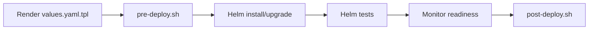

# Hook Scripts

This page covers the pre-deploy and post-deploy hook script mechanism in
Helmet. After reading this page, you will understand how to add shell scripts
to your installer that execute around the deployment lifecycle, how template
values are passed as environment variables, and how errors affect deployment.

**Scope**: Hook discovery, execution, environment variables, error handling.
For the overall deployment lifecycle that hooks participate in, see
[`docs/architecture.md`](architecture.md). For Helm chart structure and
annotations, see [`docs/topology.md`](topology.md).

## Overview

Hooks are shell scripts that run before and after the Helm install/upgrade
operation for each chart. They provide the ability to execute custom logic using
local CLI tools (`kubectl`, `oc`, and others) that Helm charts cannot natively
express through Kubernetes resources.

Hook scripts live inside the chart directory (in a `hooks/` subdirectory) and
are embedded into the installer executable along with all other installer
resources via the `go:embed` tarball. At runtime, the framework extracts
hook scripts from the loaded chart's `Files` array -- the Helm SDK's mechanism
for non-template files included in a chart directory.

Hooks are intended as temporary measures. When possible, replace hook scripts
with Helm chart resources or native Helm hooks.

## Hook Types

| Hook | Script Name | Execution Point |
|------|-------------|-----------------|
| Pre-deploy | `pre-deploy.sh` | Before Helm install/upgrade |
| Post-deploy | `post-deploy.sh` | After Helm install/upgrade, tests, and readiness monitoring |

Both hooks are optional. If a script is not present in the chart, the hook is
silently skipped.

## Chart Directory Layout

Place hook scripts in a `hooks/` directory inside the chart:

```
installer/
├── config.yaml
├── values.yaml.tpl
└── charts/
    └── my-chart/
        ├── Chart.yaml
        ├── values.yaml
        ├── hooks/
        │   ├── pre-deploy.sh
        │   └── post-deploy.sh
        └── templates/
            └── ...
```

When the installer tarball is built, these scripts are packaged alongside the
chart. When the tarball is embedded via `go:embed`, the scripts travel inside
the binary. At runtime, `ChartFS` walks the chart directory and feeds all files
to the Helm SDK's `loader.LoadFiles()`. Non-template files -- including
`hooks/*.sh` -- end up in the `chart.Chart.Files` array, where the hooks
system finds them by matching the exact paths `hooks/pre-deploy.sh` and
`hooks/post-deploy.sh`.

## Deployment Lifecycle Position

Hooks execute at specific points in the per-chart deployment sequence:



1. The template engine renders `values.yaml.tpl` into Helm values
2. **Pre-deploy hook** runs with the rendered values as environment variables
3. Helm install or upgrade executes
4. Helm tests run via `VerifyWithRetry()`
5. Resource readiness monitoring completes
6. **Post-deploy hook** runs with the same rendered values

## Environment Variables

Hook scripts receive the rendered template values as environment variables. The
framework flattens the values map into uppercase variables with double-underscore
separators, prefixed with `INSTALLER`.

### Conversion Rules

| Values structure | Environment variable |
|-----------------|---------------------|
| `key: value` | `INSTALLER__KEY=value` |
| `key: { nested: value }` | `INSTALLER__KEY__NESTED=value` |
| `key: { a: { b: value } }` | `INSTALLER__KEY__A__B=value` |

All values are converted to strings via Go's `fmt.Sprintf("%v", v)`. Nested
maps are recursively flattened. The hook script also inherits all environment
variables from the parent process.

### Example

Given these rendered values:

```yaml
domain: apps.example.com
auth:
  enabled: true
  provider: github
```

The hook script receives:

```bash
INSTALLER__DOMAIN=apps.example.com
INSTALLER__AUTH__ENABLED=true
INSTALLER__AUTH__PROVIDER=github
```

## Writing Hook Scripts

### Pre-deploy Script

Runs before Helm install/upgrade. Use for setup tasks that must complete before
chart resources are created:

```bash
#!/usr/bin/env bash

echo "Pre-deploy for chart"

# Example: create a prerequisite resource
kubectl apply -f /path/to/prerequisite.yaml
```

### Post-deploy Script

Runs after Helm install/upgrade and readiness monitoring. Use for validation or
follow-up tasks after all chart resources are ready:

```bash
#!/usr/bin/env bash

echo "Post-deploy validation complete"

# Example: verify an endpoint is responding
curl --fail "https://${INSTALLER__DOMAIN}/healthz"
```

### Conventions

- Start with `#!/usr/bin/env bash`
- Scripts do not need execute permissions in the source tree -- the framework
  sets `0755` permissions automatically before execution
- Use environment variables (prefixed `INSTALLER__`) to access template values
- Keep scripts idempotent -- deployments may be retried

## Error Handling

| Scenario | Behavior |
|----------|----------|
| Hook script not found in chart | Silently skipped (returns `nil`) |
| Script exits with non-zero code | Deployment aborts with error |
| Temporary file creation fails | Deployment aborts with error |
| File I/O error | Deployment aborts with error |

A failing pre-deploy hook prevents the Helm install/upgrade from running. A
failing post-deploy hook reports an error after the Helm operation has already
completed.

## Dry-Run Behavior

When the `--dry-run` flag is set, both pre-deploy and post-deploy hooks are
skipped entirely, along with Helm tests and readiness monitoring. Only the Helm
install/upgrade runs (in server-side dry-run mode). The framework logs a debug
message indicating the skip. See
[architecture.md § Request Lifecycle](architecture.md#request-lifecycle) for
the full dry-run behavior across all pipeline steps.

## Execution Mechanism

The framework executes hook scripts as local subprocesses:

1. Reads the script bytes from the chart's `Files` array (populated from the
   embedded tarball at chart load time)
2. Writes the bytes to a temporary file via `os.CreateTemp`
3. Sets execute permissions (`0755`)
4. Runs the script as a subprocess via `os/exec`
5. Connects stdout and stderr to the installer's output streams
6. Removes the temporary file after execution

Scripts run in the same security context as the installer process. They have
access to the same filesystem, network, and Kubernetes credentials (via
`KUBECONFIG` or in-cluster config).

## Test Fixture Reference

The `test/charts/testing/` chart includes example hook scripts:

**`hooks/pre-deploy.sh`**:
```bash
#!/usr/bin/env bash

echo "This script runs before the installation of the chart"
echo "# INSTALLER__KEY__NESTED='${INSTALLER__KEY__NESTED}'"
```

**`hooks/post-deploy.sh`**:
```bash
#!/usr/bin/env bash

echo "This script runs after the installation of the chart"
```

These scripts demonstrate environment variable access and basic pre/post
lifecycle usage.

## Relationship with Helm Hooks

Helmet hook scripts (`hooks/pre-deploy.sh`, `hooks/post-deploy.sh`) are
separate from native [Helm hooks](https://helm.sh/docs/topics/charts_hooks/).
Helm hooks are Kubernetes resources annotated with `helm.sh/hook` that run as
Jobs during the Helm lifecycle. Helmet hooks are shell scripts embedded in the
installer executable that run as local subprocesses on the machine running the
installer.

| Aspect | Helmet Hooks | Helm Hooks |
|--------|-------------|------------|
| Execution | Local subprocess | Kubernetes Job |
| Access | Local CLI tools, filesystem | Cluster resources only |
| Definition | `hooks/*.sh` in chart directory | Annotated templates in `templates/` |
| Embedding | Packed in installer tarball, embedded in binary | Part of chart templates |
| Lifecycle | Before/after Helm install per chart | Helm-defined hook points |

Both mechanisms can coexist in the same chart.

## Cross-References

- [Architecture](architecture.md) -- deployment lifecycle and component
  relationships
- [Topology](topology.md) -- chart annotations and dependency resolution
- [Installer Structure](installer-structure.md) -- tarball layout, `go:embed`,
  overlay filesystem
- [Example Charts](example-charts.md) -- test chart reference including the
  `testing` chart with hook scripts
- [CLI Reference](cli-reference.md) -- `--dry-run` flag behavior